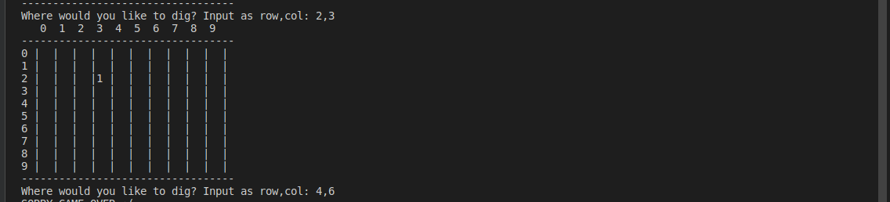
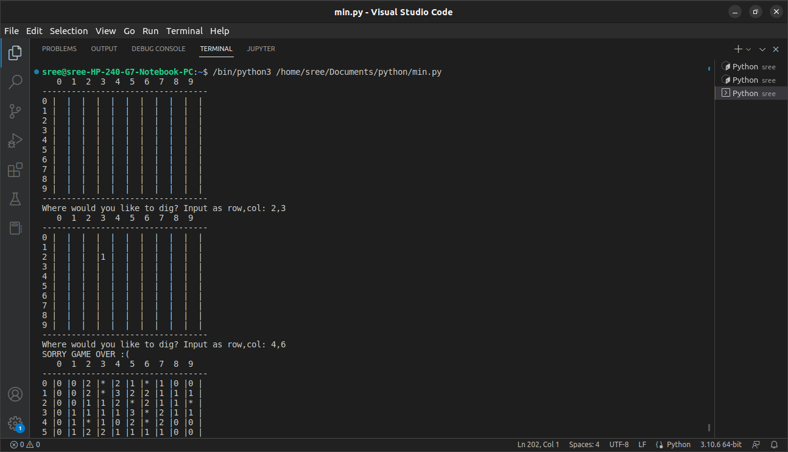
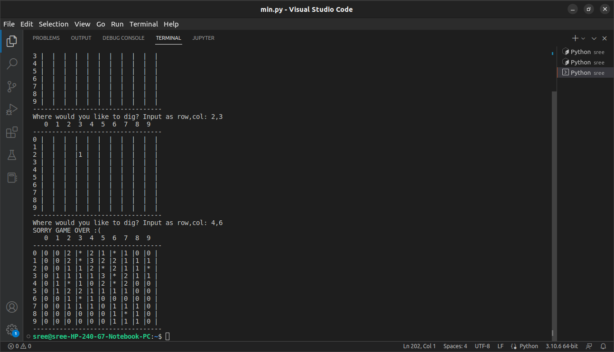

#  MINESWEEPER

Minesweeper is a logic puzzle video game genre generally played on personal computers. The game features a grid of clickable squares, with hidden "mines" scattered throughout the board. The objective is to clear the board without detonating any mines, with help from clues about the number of neighboring mines in each field.   

## Table of Contents:
1. ### History
2. ### Algorithm
3. ### Explanation
4. ### Advantage
5. ### Sneak peak

##  HISTORY :

According to TechRadar, Minesweeper was created by Microsoft in the 1990s,[6] but Eurogamer commented that Minesweeper gained a lot of inspiration from a "lesser known, tightly designed game", Mined-Out by Ian Andrew for the ZX Spectrum in 1983.

##   ALGORITHM :

Basically the whole programme revolves around the OOPs(Object Oriented Programming) Concept.

1. The code starts by making the board 9X9 board for the player.

2. The bombs are placed randomly by the compiler when the code is run.

3. The safe places are marked from 0-8.

4. The user is asked to dig the place after that in the format("Where would you like to dig? Input as row,col:" 2,3). If he/she digs in the safe spot the games goes on otherwise the game ends.
with an output("SORRY GAME OVER :(")

5. A safe boolean is kept free to keep on updating the dig() function.

6. Now, a safe boolean is kept to analyse the win or the game over :(

##   EXPLANATION :

1. When the code is run in the terminal the grid(9x9)is shown.

2. The user is asked to input the row and colum of his stepping in the (row,column) format.

3. If the place the player stepped doesn't have a mine the next place to be stepped is asked to the player.

4. Unfortunately if the player stepped on the mine the game ends and the whole step up of the mine and safe zones is showed to the user.

5. After the game ends the step up is reset again and the player has to run again the code for a new game.

##   ADVANTAGES :
 - To run this game no new modules are been required to be installed.

- A simple terminal is only needed to play the game

- Easy to play and exciting too

- Increases Analytical skills of the user.

- Minesweeper can help you improve your problem-solving skills and become a better gamer.

- Makes the player more patient and more focused .

  
 

##   SNEAK PEAK :

