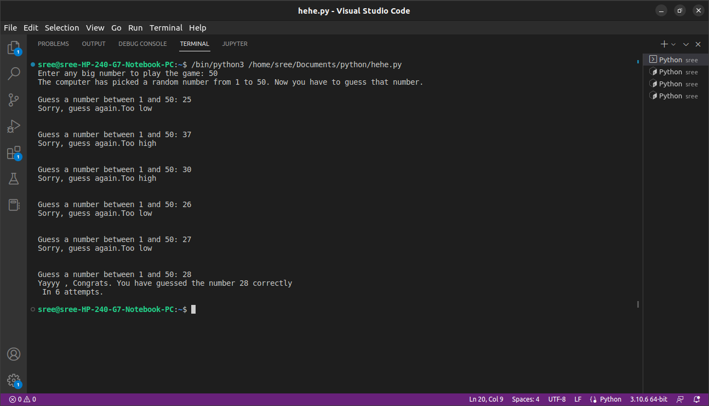

#  NUMBER GUESSING GAME :)

The world of maths helping the users by increasing the instincts of them by a cool game of guessing the number given by the user.

## Table of Contents :
### 1. Algorithm
### 2. Explanation
### 3. Advantages
### 4. Sneak Peak

##  ALGORITHM :
1. User inputs the upper bound of the range.

2. The compiler generates a random integer between the range and stores it in a variable for future references.

3. For repetative guessing, a while loop will be initialized.

4. If the user guessed a number which is smaller than the randomly selected number, the user gets an output "Sorry,guess again.Too low"

5. If the user guessed a number which is greater than the randomly selected number, the user gets an output "Sorry,guess again.Too high"

6. And if the user guessed in a minimum number of guesses the user gets a " Yayy,Congrats.You have guessed the number(the number generated) correctly in the no of attempts." Output.

##  EXPLANATION:
1. If the user inputs the upper range,let's say from 1 to 50. And compiler selected 42 as the integer.

2. And now the guessing game started. So, the half of 50 is 25. The user enters 25 as his/her first guess. This time compiler will show, "Sorry,guess again.Too low".  
That's mean the integers less than 25(from 1 to 25)are useless to be guessed.

3. Now the range for user guessing is shorter, i.e from 25 to 50.Intelligently! user guessed half of this range, so that,user guessed 37 as his/her second guess.  
This time again the compiler shows the output,"Sorry,guess again.Too low".

4. For the user, the guessing range is getting smaller by each guess.

5. Now, the guessing range for user is from 37 to 50, for which the user guessed 43 as his/her third guess.

6. This time the compiler will show an output "Sorry,guess again.Too high". So, the new guessing range for users will be from 37 to 43, again for which the user guessed the half of this range,that is 40 as his/her fourth guess.  
This time the compiler shows the output,"Sorry,guess again.Too low".

7. Leaving the guess even smaller range such that from 41 to 43.And now the user guessed 41 as his/her fifth guess. Which is wrong and shows output "Sorry,guess again.Too low".

8. And finally,the user guessed the right numbrer which is 42 as his/her sixth guess.

Yayy,Congrats. You have guessed the number 42 correctly  
In 6 attempts.

##  ADVANTAGES:
- To run this game no new modules are been required to be installed.

- A simple terminal is only needed to play the game

- Easy to play and exciting too

- Increases Analytical skills of the user.

  
 

##  SNEAK PEEK:
