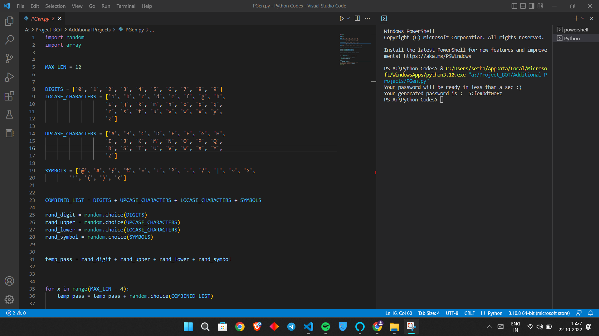

# Password Generator in Python
Having a weak password is not good for a system that demands high confidentiality and security of user credentials. It turns out that people find it difficult to make up a strong password that is strong enough to prevent unauthorized users from memorizing it. 


## How to Install

1. Create a ```python``` virtual environment. 
2. Clone the repo ```git clone https://github.com/SamarthTMSL/Python-Games-and-Projects.git``` or download the repository.
3. Go to the cloned/downloaded directory ``` cd Password Generator ``` 
4. Run ``` pip3 install random ```
5. And now you can run the example scripts or create your own scripts.
6. If the program doesn't run, run it in VS Code.


## Usage
To generate a password, run ``` python3 Password_Generator.py```

## Demo



## FAQ
- How to stop the script? Ctrl+C (control+C for Mac) 
- For any other problems, feel free to raise an issue.

## Contributing
Pull requests are welcome. For major changes, please open an issue first to discuss what you would like to change. 

Please make sure to update tests as appropriate.


## What next?
I will be working on making new games :)

## 🙋‍♂️ Support

💙 If you like this project, give it a ⭐ and share it with friends!<br><br>


---

Made with ❤️ and Python <br><br>